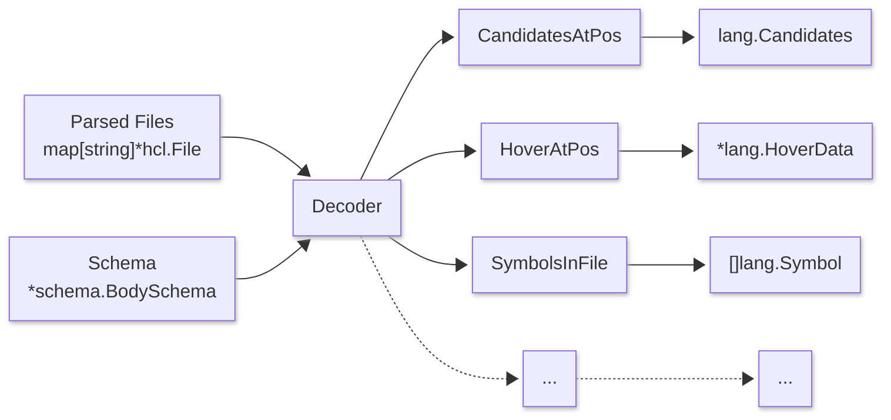
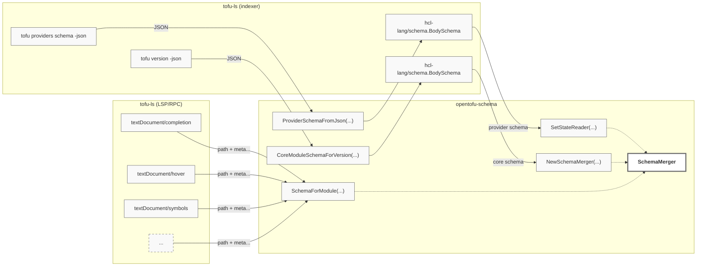
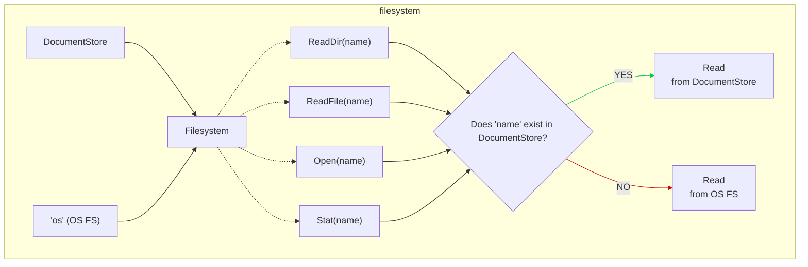
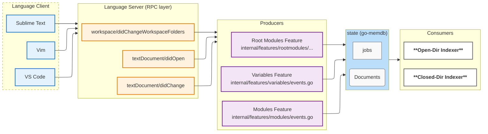
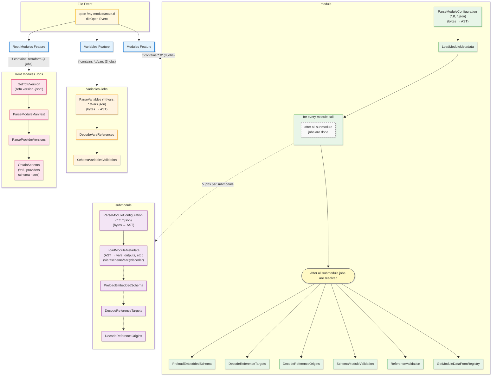
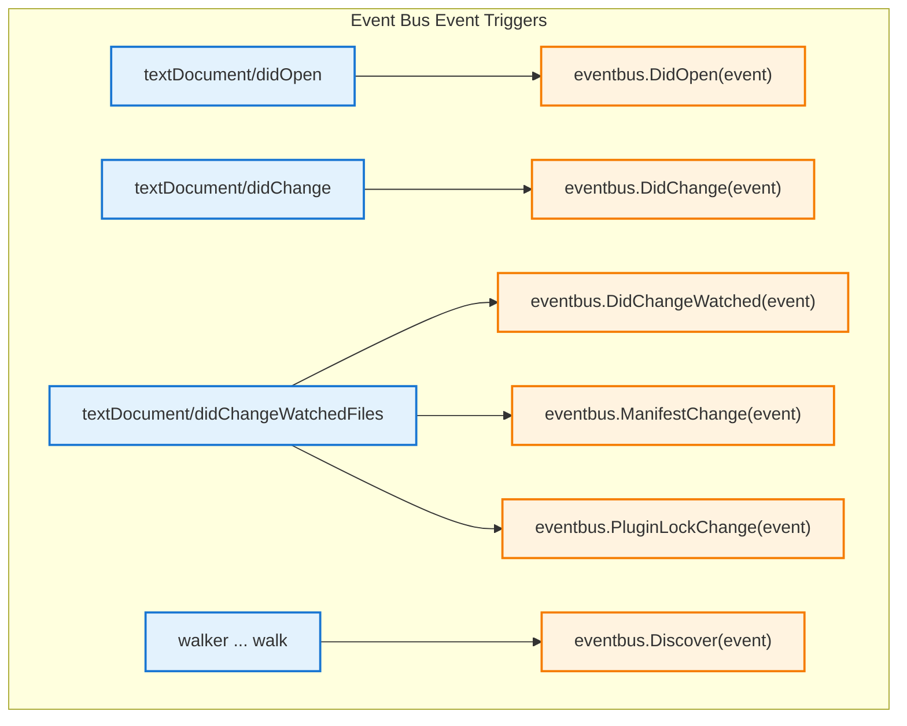

# Language Server Architecture

This is a summary of some main components of the language server, aiming to help maintainers and contributors with navigating the codebase.

## Decoder

Majority of the language server functionality such as completion, hover, document links, semantic tokens, symbols etc. are provided by [the `decoder` package of `hashicorp/hcl-lang`](https://pkg.go.dev/github.com/hashicorp/hcl-lang@main/decoder). `hcl-lang` is generally considered a reusable component for any HCL2-based language server (that is not _just_ OpenTofu). Any functionality which other HCL2-based language server may reuse should be contributed there, not into `tofu-ls`.

The decoder essentially takes in directories of parsed HCL files + schemas and uses both to walk the AST to provide completion candidates, hover data and other relevant data.

## Schema

Decoder needs schema to produce relevant completion candidates, hover data etc. [`opentofu/opentofu-schema`](https://pkg.go.dev/github.com/opentofu/opentofu-schema) houses most of the OpenTofu Core schema (such as `terraform`, `resource` or `variable` blocks) + helpers to combine that [Core schema](https://github.com/opentofu/opentofu-schema/tree/main/internal/schema) with provider schemas (such as inner parts of `resource` or `data` blocks) and help assemble schemas for modules.

## Global State

Most of the global state is maintained within various [`go-memdb`](https://pkg.go.dev/github.com/hashicorp/go-memdb) tables under [`state`](https://pkg.go.dev/github.com/opentofu/tofu-ls@main/internal/state) package, passed around via [`state.StateStore`](https://pkg.go.dev/github.com/opentofu/tofu-ls@main/internal/state#StateStore).

This includes

- `documents` - documents open by the client (see [Document Storage](#document-storage))
- `jobs` - pending/running jobs (see [Job Scheduler](#job-scheduler))
- `modules` - AST and other metadata about OpenTofu modules collected by indexing _jobs_ ^
- `provider_schemas` - provider schemas pre-baked or obtained via OpenTofu CLI by indexing _jobs_ ^
- `provider_ids` & `module_ids` - mapping between potentially sensitive identifiers and randomly generated UUIDs, to enable privacy-respecting telemetry

## Document Storage

`documents` package, and [`document.Document`](https://pkg.go.dev/github.com/opentofu/tofu-ls@main/internal/document#Document) struct in particular represents open documents server receives from the client via LSP text synchronization methods such as `textDocument/didOpen`, `textDocument/didChange`, stored as an entry in the `documents` memdb table. The `textDocument/didClose` method removes the document from state, making other components assume that it then matches OS filesystem.

AST representation of these documents is passed to the decoder, which in turn ensures that all completion candidates, hover data etc. is relevant to what the user sees in their editor window even if the file/document is not saved.

Each document also maintains line-separated version, to enable line-based diffing and to enable conversion between LSP's representation of position (line:column) to HCL's representation (`hcl.Pos`) which mostly uses byte offsets.

## Filesystem

`filesystem` package provides an `io/fs` compatible interface primarily for any jobs which need to operate on the whole directory (OpenTofu module) regardless of where the file contents comes from (virtual document or OS filesystem).

## LSP/RPC Layer

`langserver` package represents the RPC layer responsible for processing any incoming and outgoing LSP (RPC JSON) requests/responses between the server and client. The `langserver/handlers` package generally follows a pattern of 1 file per LSP method. The package also contains E2E tests which exercise the language server from client's perspective. [`service.go`](https://github.com/opentofu/tofu-ls/blob/main/internal/langserver/handlers/service.go) represents the "hot path" of the LSP/RPC layer, basically mapping functions to method names which the server supports.

[`protocol`](https://pkg.go.dev/github.com/opentofu/tofu-ls@main/internal/protocol) package represents the structs reflecting LSP spec, i.e. the structure of request and response JSON bodies. Given that there is no other complete and/or well-maintained representation of the LSP spec for Go (at the time of writing), majority of this is copied from within `gopls`, which in turn generates these from the TypeScript SDK - practically the only officially maintained and most complete implementation of LSP spec to date.

Mentioned `protocol` request/response representations may not always be practical throughout the codebase and within `hcl-lang`, therefore `lsp` package contains various helpers to convert the `protocol` types from and to other internal types we use to represent the same data. It also filters and checks the data using client and server capabilities, such that other parts of the codebase don't have to.

## "Features"

The `internal/features` package tries to group certain "dialects" of the OpenTofu language into self-contained features. A feature manages its own state, jobs, decoder, and file parsing logic.

We currently have several features:

- `*.tf` and `*.tf.json` files are handled in the `modules` feature
- `*.tfvars` and `*.tfvars.json` files are handled in the `variables` feature
- `.terraform/` and `.terraform.lock.hcl` related operations are handled in the `rootmodules` feature

A feature can provide data to the external consumers through methods. For example, the `variables` feature needs a list of variables from the `modules` feature. There should be no direct import from feature packages (we could enforce this by using `internal/`, but we won't for now) into other parts of the codebase. The "hot path" service mentioned above takes care of initializing each feature at the start of a new LS session.

The `jobs` package of each feature contains all the different indexing jobs needed to retrieve all kinds of data and metadata, to perform completion, hover, go-to-definition, and so on. The jobs are scheduled on the global job scheduler as a result of various events (e.g. `didOpen`).

### Modules Feature Jobs

- `ParseModuleConfiguration` - parses `*.tf` files to turn `[]byte` into `hcl` types (AST)
- `LoadModuleMetadata` - uses [`earlydecoder`](https://pkg.go.dev/github.com/opentofu/opentofu-schema@main/earlydecoder) to do early Tofu version-agnostic decoding to obtain metadata (variables, outputs etc.) which can be used to do more detailed decoding in hot-path within `hcl-lang` decoder
- `PreloadEmbeddedSchema` – loads provider schemas based on provider requirements from the bundled schemas
- `DecodeReferenceTargets` - uses `hcl-lang` decoder to collect reference targets within `*.tf`
- `DecodeReferenceOrigins` - uses `hcl-lang` decoder to collect reference origins within `*.tf`
- `GetModuleDataFromRegistry` - obtains data about any modules (inputs & outputs) from the Registry API based on module calls
- `SchemaModuleValidation` - does schema-based validation of module files (`*.tf`) and produces diagnostics associated with any "invalid" parts of code
- `ReferenceValidation` - does validation based on (mis)matched reference origins and targets, to flag up "orphaned" references
- `TofuValidate` - uses OpenTofu CLI to run the validate subcommand and turn the provided (JSON) output into diagnostics

### Variables Feature Jobs

- `ParseVariables` - parses `*.tfvars` files to turn `[]byte` into `hcl` types (AST)
- `DecodeVarsReferences` - uses `hcl-lang` decoder to collect references within `*.tfvars`
- `SchemaVariablesValidation` - does schema-based validation of variable files (\*.tfvars) and produces diagnostics associated with any "invalid" parts of code

### Root Modules Feature Jobs

- `GetTofuVersion` - obtains OpenTofu version via `tofu version -json`
- `ParseModuleManifest` - parses module manifest with metadata about any installed modules
- `ObtainSchema` - obtains provider schemas via `tofu providers schema -json`
- `ParseProviderVersions` is a job complimentary to `ObtainSchema` in that it obtains versions of providers/schemas from OpenTofu CLI's lock file

### Adding a new feature / "language"

The existing `variables` feature is a good starting point when introducing a new language. Usually you need to roughly follow these steps to get a minimal working example:

1. Create a new feature with the same folder structure as existing ones
1. Model the internal state representation
1. Subscribe to some events of the event bus
1. Add a parsing job that gets triggered from an event
1. Add a decoder that makes use of some kind of schema
1. Register the new feature in `internal/langserver/handlers/service.go`
    - Start the feature as part of `configureSessionDependencies()`
    - Make sure to call the `Stop()` function in `shutdown()` as well
1. If the feature reports diagnostics, add a call to collect them in `updateDiagnostics()` in `internal/langserver/handlers/hooks_module.go`

## Job Scheduler

All jobs end up in the `jobs` memdb table, from where they're picked up from by any of the two schedulers described below.

[`scheduler`](https://pkg.go.dev/github.com/opentofu/tofu-ls@main/internal/scheduler) contains a relatively general-purpose implementation of a job scheduler. There are [two instances](https://github.com/opentofu/tofu-ls/blob/031e30f62ab169104837fbb1e9ef2633ded73329/internal/langserver/handlers/service.go#L427-L435) of the scheduler in use, both of which are launched by `initialize` LSP request and shut down with `shutdown` LSP
request.

- `openDirIndexer` processes any jobs concerning directories which have any files open
- `closedDirIndexer` processes any jobs concerning directories which do _not_ have any files open

The overall flow of jobs is illustrated in the diagram below.

The mentioned `documents` memdb table is consulted for whether a directory has any open files - i.e. whether server has received `textDocument/didOpen` and _not_ `textDocument/didClose` concerning a particular directory. Using two separate schedulers loosely reflects the fact that data for files which the user is editing at the moment are more critical, unlike additional data about other directories/modules which would only _enrich_ editing of the open files (such as by adding cross-module context, providing go-to-definition etc.).

Jobs also depend on each other. These dependencies are illustrated in the diagrams below.

### didOpen Job Flow

## Event Bus

The [`eventbus`](https://github.com/opentofu/tofu-ls/blob/main/internal/eventbus/bus.go) is responsible for distributing events to subscribers. It comes with a fixed list of topics that anyone can subscribe to. An event is sent to all subscribers of a topic. A subscriber can decide to block until the event is processed by using a return channel. It is primarily used to distribute LSP document synchronization events.

### Event Sources

## Walker

The Walker is responsible for walking the file system hierarchy of the entire workspace (including files that the user may not have open) in the background to gain a better understanding of the workspace structure. The walker doesn't schedule any jobs and doesn't do any additional work other than reporting the directory structure and the files it contains. The walker follows the LSP/RPC lifecycle of the server, i.e. it is started by an `initialize` request and shut down by a `shutdown` request.

The walker logic is contained in [`internal/walker/walker.go`](https://github.com/opentofu/tofu-ls/blob/main/internal/walker/walker.go).

## Watched Files

Clients are expected to watch `*.tf` and `*.tfvars` files by default and send updates to the server via [`workspace/didChangeWatchedFiles` notifications](https://microsoft.github.io/language-server-protocol/specifications/lsp/3.17/specification/#workspace_didChangeWatchedFiles). Additionally, the server uses [dynamic watcher registration](https://microsoft.github.io/language-server-protocol/specifications/lsp/3.17/specification/#didChangeWatchedFilesRegistrationOptions) per LSP to instruct clients to watch for plugin and module lock files within `.terraform` directories, such that it can refresh schemas or module metadata, both of which can be used to provide IntelliSense.

The mentioned dynamic registration happens as part of [`initialized`](https://github.com/opentofu/tofu-ls/blob/ca335f5ec3f320ab5a517592ae63ac90b04f127f/internal/langserver/handlers/initialized.go#L22-L71).

[`workspace/didChangeWatchedFiles` handler](https://github.com/opentofu/otfu-ls/blob/ca335f5ec3f320ab5a517592ae63ac90b04f127f/internal/langserver/handlers/did_change_watched_files.go#L20) invalidates relevant data based on what files were changed.
